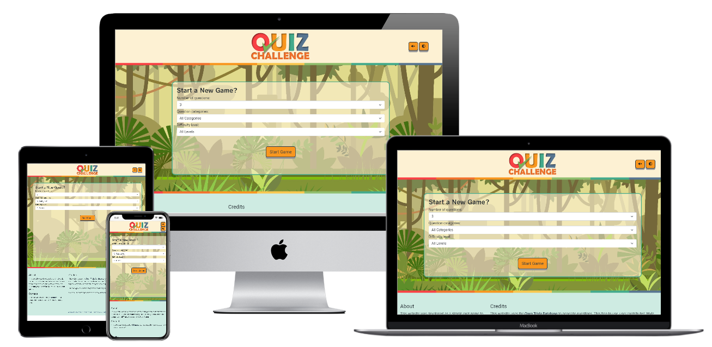

# Quiz Challenge : Trivia Game for all Ages

* A fun and addictively simple quiz game website.



## Contents

---

* UX
  * Project Goals
    * User Goals
    * User Stories
    * Site Owner Goals
    * User Requirements and Expectations
    * Design Choices
      * Fonts
        * Icons
        * Colours
* Technologies
* Features
  * Features that have been developed
    * Features that will be implemented in the future
* Testing
* Bugs
* Deployment
* Credit

## UX (User Experience)

---

### Project Goals

* The goal of this project is to create a simple, fun quiz game that is intuitive to use and draws on an 
external trivia database to maintain a user's interest by continually providing new questions.

### User Goals

* Intuitive interface that allows the first game to start with a single click.
* Further options available for changing the number of questions, selecting different quiz topics are available.
* Simple button interface for multiple choice answer selection.
* Score kept for each game so progress is always visible.

### User Stories

* As a **user**, I want to see a simple, fun and intuitive layout.
* As a **user**, I want to be able to start my first game with a single click to see if I like this game.
* As a **user**, I want to see my current score so I can keep track of how I'm doing.
* As a **user**, I want to be challenged with different questions every time I play this game.
* As a **user**, I want to be able to select different categories, quantities and difficulty levels of questions. 
* As a **user**, I may want to see who developed this game to contact them with suggestions or business proposals.

### Site Owner Goals

* As a **site-owner**, I want to make an attractive and simple interface so that people will want to play this game.
* As a **site-owner**, I want to have a varying set of trivia questions to create longer playing periods and return traffic to the site.
* As a **site-owner**, I want to have a options available to players to create a sense of customisibility to avoid player fatigue.

### User Requirements and Expectations

#### Requirements

* Simple single-page interface with header, game area and footer with about/contact/credits/disclaimer.
* Fast loading times are imperative to avoid a user leaving the page due to lag.
* Contact form for users to send requests, suggestions or trivia questions.
* Bright and cheerful colors and styling.
* Dropdowns to allow customisibility of the questions drawn.

#### Expectations

* Content is visually satisfying and exciting to look at.
* Game automatically cycles from start page, through questions to final score without glitching or issues.
* The design is responsive and will work across a wide variety of screen sizes.

### Design Choices

---
_________________________________________________

For the design of this site, I took inspriation from books and cartoons that my children are most interested in. 
The colors selected are bright pastels. Rainbow-colored hortizontal rules break between the header, game and footer areas.
A subtle jungle pastel backdrop was used to create focus on the centre of the screen. The logo is a simple rendering using
Microsoft Word's WordArt and Shapes to create a colorful text based logo. The green tick mark for Q's cross stroke is alluding
to a correct mark of a quiz. Simple shadowing has been added to give an embossed effect and make the text stand out from the 
background without resorting to deeper hued colors or outlines.

#### Fonts

* (Google Fonts)[https://fonts.google.com/] has been used to add typographic style to the site.
With legibilty and ease of eye strain being a key focus of a text-based game that involves a lot of reading,
(Roboto)[https://fonts.google.com/specimen/Roboto] was chosen as the main font with 
(RocknRoll One)[https://fonts.google.com/specimen/RocknRoll+One] being used for some of the heading text for a more fun font.
The main logo was designed in Microsoft Word with the Berlin Sans font.

#### Icons

* (FontAwesome)[https://fontawesome.com/] free icons have been used throughout this project.

#### Colors

The website colors were chosen using [coolors.co](https://coolors.co/).


## Wireframing

<details>
  <summary>Wireframing was done using Balsamiq under full-functional trial provided by Code Institute.
Wireframes were developed for a start screen, question screen and score screen. The main elements of
these wireframes were relatively faithfully produced. Other aspects of the design developed more organically.</summary>

#### Project Wireframes

* Start Screen Wireframe
* 
* Question Screen
* 
* Score Screen
* 

</details>

---

## Features

---
**Features** that have been **implemented:**

* Responsive design using Bootstrap.
* Fetch quiz categories from opentdb.com for the quiz and provide in a HTML dropdown to the user.
* Fetch quiz questions as per user selection and store in an array of objects for the quiz game.
* Simple, single player mode game that cycles through game questions.
* Aubible and visual indication of correct/incorrect answers.
* Final score screen with number and percentage of correct answers displayed.

**Features** that will be **implemented** in the **future:**

* Two player mode. (This is my single biggest disappointment that I did not have time to get this implemented before project submission.)
* Google text-to-speech api to read questions and answer choices.
* Change the picture backgrounds to suit the quiz category. The work involved here made this prohibitive in the project timeline and it may have been difficult to match in with the style of the project.

## Technologies Used

---

### Languages

* HTML
* CSS
* JavaScript

### Tools & Libraries

* [Git](https://git-scm.com/)
* [Bootstrap](https://getbootstrap.com/)
* [Font-Awesome](https://fontawesome.com/icons?d=gallery)
* [Popper](https://popper.js.org/)
* [JQuery](https://jquery.com/)
* [Google fonts](https://fonts.google.com/)
* [Markdownlint](https://dlaa.me/markdownlint/)

## Testing

---

### HTML Test

HTML code has been tested using the [HTML Validator](https://validator.w3.org/) and gave the following error:

#### HTML Test Errors

* ___________________________________________
```

#### HTML Test Fixes

* ______________________________________________________

### CSS Test

CSS code has been tested using the [CSS validator](http://jigsaw.w3.org/css-validator/) and gave the following errors and warnings.

#### CSS Test Errors

 ______________________________________________________

#### CSS Test Warnings

``` css
    _______________________________________________________
```

#### CSS Test Fixes

* ___________________________________________________________

### Responsiveness

* ______________________________________________________________________________________________________________________

<details>
  <summary>Responsiveness of the design was tested using Chrome's Developer Tools and the result overall was a xxxxxxxxxxxxxx  **PASS**   xxxxxxxxxxxxx. Open the dropdown here to see screenshots of the results.</summary>

#### Summary of responsive design tests

* Full Screen 24” Browser Window – Google Chrome – No Issues - **PASS**
  * Result: 
  * ______________________________________________________________________________________________________________________

</details>

### Design

* ___________________________________________________________

### Contact form

* ___________________________________________________________

### User Stories

<details>
  <summary>User stories were tested using Google Chrome and developer tools. The only item of note which could be described as noteable sub-par would be the loading speed which needs improvement. Click dropdown to see individual tests.</summary>
  
#### Summary of user tests

* Test: As a **user**, I want to see all the main services this company can offer at a glance so that in a single scroll of the homepage, I know exactly what this company has to offer.
  * Result: 
  * Test: As a **user**, I want **fast loading-times** for pages.
  * Result: 
  * Test: As a **user**, I want a **simple and well laid-out** website that gives the impression of these complex topics being made simple.
  * Result: 
  * Test: As a **user**, I want to see **modern design** to show that the site owner is au fait with the latest developments in technology.
  * Result: 
  * Test: As a **user**, I want to see some **examples of previous projects** done by this company.
  * Result: 
  * Test: As a **user**, I want to see references to **industry standards** to be sure the deliverables will meet my company's specifications.
  * Result: 
  * Test: As a **user**, I want to be able to **contact** the site owner and give a simple description of a potential project.
  * Result: 

</details>

## Bugs

---

Many bugs were encountered during the development of the project - all admittedly of my own making.

### Development Bugs

* The opentdb api was very, very difficult to get working as a JavaScript learner. I had serious difficulty 
fetching the JSON and storing this question data in an array of objects to be used in the quiz loop.
* Special HTML character codes were being displayed in the question and answer fields. E.g. &quot;, &#039;. 
Code was initially written in to use array.replace() to find and replace them out. The actual solution was 
to write the text strings from JS to HTML targetting the .innerHTML rather than .textContent. This avoided 
the information being passed to the browser inside quotes as a string and thus was interpreted as a special 
character code rather than a string.
* Deploying to GitHub Pages caused soSme difficulty where JS files were not being loaded. The was corrected by
 removing a preceding '/' from the source link.
* A number of minor warnings were picked up by [JSHint.com](https://jshint.com/) such as missing semicolons and
undeclared variables. These were amended as found and documented with 'Fix' commits.
* On GitHub pages, the eventlisteners for buttons threw up a 'cannot read property of null' issue during testing.
A solution was found on [StackOverflow](https://stackoverflow.com/questions/26107125/cannot-read-property-addeventlistener-of-null).
By moving event listeners into the window.onload function, the event listeners would not be called before the page had loaded.


### Testing Bugs

* A few bugs were thrown up by the HTML Validator and CSS Validator. The solutions are given above in the **HTML Test** and **CSS Test** Sections.

## Deployment

---

The site has been deployed on [GitHub Pages](https://pages.github.com/) with under the following link [QuizChallenge](https://starrant.github.io/QuizChallenge/).

## Credits

---

* The jungle background vector was created by (katemangostar)[https://www.freepik.com/katemangostar], provided by (Freepik)[https://www.freepik.com/vectors/background] 
and used for free following their (attribution rules)[https://support.freepik.com/hc/en-us/articles/208976585-How-do-I-insert-the-attribution-correctly-].
* [JSHint.com](https://jshint.com/) was used to error check the JavaScript code.
* [Markdown guide basic syntax](https://www.markdownguide.org/basic-syntax/) was used as a reference in writing the README.md file.
* [Markdownlint](https://dlaa.me/markdownlint/) by [David Anson](https://github.com/DavidAnson) was used for correcting the errors in my markdown. It is an awesome resource and saved me hours of correction time.
* Code for box shadow on overview section generated by [cssgenerator.org](https://cssgenerator.org/box-shadow-css-generator.html). CSS code commented as such as per CI guidelines.
* Code for button styling has been based on modifed versions of code from [w3schools animated button pressed effect](https://www.w3schools.com/css/tryit.asp?filename=trycss_buttons_animate3).
* The website [w3schools](https://www.w3schools.com/) was used heavily as a reference for HTML, CSS and Bootstrap throughout the project. As were [GetBootstrap](https://getbootstrap.com/), [StackOverflow](https://stackoverflow.com/) and [CSSTricks](https://css-tricks.com/).
* The [w3schools color mixer tool](https://www.w3schools.com/colors/colors_mixer.asp) was used to get lighter or darker variants of the site's main colors for hover effects, etc.
* [Techsini](http://techsini.com/multi-mockup/index.php) was used to generate the multidevice image shown on at the start of the readme.
* Sounds for correct and incorrect answer were created by [LittleRainySeasons](https://freesound.org/people/LittleRainySeasons/) and [Aiwha](https://freesound.org/people/Aiwha/) respectively, provided by [freesound](https://freesound.org/) and used under CC licencing rules for non-commercial/creator attribution.
* [Online Audio Converter](https://online-audio-converter.com/) was used to convert .wav files to .mp3 format to reduce file size.

### Special Thanks

* My Code Institute mentor, [Simen Daehlin](https://github.com/Eventyret), for a lot of great advice and direction along the way. His time, effort and experience made a huge difference to the code quality, readability and end result. It would be hard to overstate his input here.
* Include thanks to ByIlsa... ********